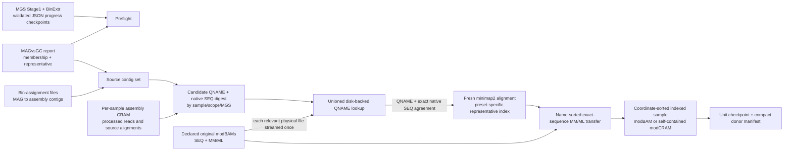

<!-- Documentation navigation -->
[Home](../README.md) | [Workflows](common_workflows.md) | [Outputs](outputs.md) | [Flag reference](flag_reference.md)

# meth2rep: standalone post-MGS methylation reconstruction

`meth2rep.pl` runs on an **already processed** MATAFILER4 cohort. It is never launched by `geneCat.pl` or `MGS.pl` and does not alter assembly, MAGs, MGSs, taxonomy, abundance, or strain products. It writes only beneath its own output directory, except when `--out-manifest` names another location.

## Data path



The assembly CRAM is a **candidate filter**, not a reusable alignment. MATAFILER's assembly reads can have been cleaned, while methylation calls belong to the original modBAM sequence. We therefore use the CRAM's contig/QNAME relationship, require its complete native-orientation sequence to match the declared donor, retrieve that original full read, and map it anew to the representative MAG. We do not fabricate alignments by copying CRAM POS/CIGAR.

`--mgs2rep` draws candidates from all non-Canopy member MAGs of an MGS. `--rep2rep` draws only from its starred representative MAG. At least one flag is required; both can be used together. When both are active for a sample/scope, `rep2rep` is an exact read-name subset of the transferred `mgs2rep` alignment. A later request for only the previously uncomputed mode processes only that mode.

## Required provenance and readiness

| Input | Typical location | Why it is needed |
|---|---|---|
| MGS directory | `<GCd>/Bin_SB` | Contains the stage progress checkpoints and final representative products. |
| JSON progress checkpoints | `<MGS dir>/LOGandSUB/checkpoints/{Stage1,BinExtr}.stone` | Both must be nonempty, parseable, have the expected stage labels, and validate all recorded outputs. Selected representative FASTAs must be recorded in `BinExtr.stone`. A `pipeline.log` or an empty legacy stone is **not** accepted as completion evidence. |
| MGS report | `<MGS dir>/MAGvsGC.txt.gz` | Exact MGS membership and unique starred non-Canopy representative; it must not have been modified after `Stage1.stone`. |
| Representative contigs | `<MGS dir>/Genomes/MGS_ctg/<MGS>.ctgs.<MAG>` with `.fa.gz`, `.fna.gz`, or `.fasta.gz` suffix | The sole mapping reference; the extension follows the MAG identifier. |
| Catalog map | `<GCd>/LOGandSUB/inmap.txt`, possibly with catalog-local maps | Sample names, assembly groups, workdirs, primary/support sequencing technologies. Supply the same map specification used by MGS. |
| Final assembly FASTA and bin assignments | `<assembly>/scaffolds.fasta.filt`, `<assembly>/Binning/<binner>/<sample>` | Source contig namespace and MAG-to-contig membership. |
| Assembly backmapping CRAM and stone | `<sample>/mapping/<sample>-smd.cram[.sto]`; support uses `<sample>.sup-smd.cram[.sto]` | Read names associated with source MAG contigs. CRAM retention must have been enabled in the original run. If present, `.reference.stat` must match the current assembly FASTA. |
| Original ONT/PB modBAMs | Explicit user locations | Complete original SEQ and MM/ML tags. They are never guessed from filenames or `input_raw.txt`. |
| Recorded source-input lists | `<sample>/input_raw.txt`, or cohort `Input_raw.txt`; support paths in the mapping file's `SupportReads` | These can corroborate declared donor paths. They are not a QNAME-to-BAM index, and the flat lists can mix primary and support inputs. Missing or relocated donors are warned about in the sample log. |

The progress gate proves the representative-MAG construction stages completed; it does **not** claim unrelated downstream taxonomy, abundance, or strain jobs completed. A cohort built by an older version with only empty legacy stones needs valid provenance checkpoints before this strict tool will run. Do not replace a missing progress marker with an empty file.

The modBAM manifest is a tab-separated file with this header:

```text
sample	scope	technology	modbam
S01	primary	ONT	/data/S01.run1.bam
S01	primary	ONT	/data/S01.run2.bam
S02	support	PB	/data/S02.support.bam
```

Repeated sample/scope rows are allowed for different files, and every declared donor for a reached scope is listed in the output manifest. The sample ID must be the resolved MATAFILER sample name; technology must match its mapping metadata. `primary` and `support` are separate CRAM namespaces. Original BAMs may be unmapped or aligned to another reference. `RG` and `SQ` do **not** give a reliable source-file join here; the original BAM index is coordinate-based, not a QNAME lookup. The tool scans only donor files for selected sample/scopes and requires each candidate QNAME to occur in exactly one donor and to have the exact same complete native-orientation SEQ in the source CRAM and donor. Missing names, collisions, hard clips, or same-name/different-sequence records fail closed.

## Invocation on an existing cohort

```bash
perl secScripts/MGS/meth2rep.pl \
  --mgs-dir /cohort/gene_catalog/Bin_SB \
  --map /cohort/gene_catalog/LOGandSUB/inmap.txt \
  --modbam-manifest /cohort/modbams.tsv \
  --mgs MGS.532,MGS.255 \
  --mgs2rep --rep2rep \
  -o /cohort/gene_catalog/Bin_SB/Meth2Rep
```

The output defaults to `<MGS dir>/Meth2Rep`; `-o`/`--out` is the only output location normally needed. The report and representative directory default to locations in the table. `--binner` is inferred from a `Bin_SB`-style directory name; supply it explicitly if your directory differs. `--mgs-file` can supplement or replace the comma list, and MGS selection is always explicit. Use `--plan-only` to validate inputs, tool availability, and every technology-specific minimap2 preset, then write `.meth2rep/plan.preview.tsv` without building indexes, aligning reads, or invalidating completed units.

| Control | Default | Effect |
|---|---:|---|
| `--source-min-mapq` | `10` | Inclusive assembly-CRAM MAPQ floor; unknown MAPQ 255 is excluded. |
| `--source-min-coverage` | `0.5` | Minimum aligned query fraction from source CIGAR, counting soft/hard clips in total query length. Set `0` to disable this floor. |
| `--target-min-mapq` | ONT `10`, PB `30` | Named override for both representative-alignment MAPQ floors. |
| `--target-min-coverage` | `0.5` | Named override for both representative-alignment query-coverage floors; set `0` to disable. |
| `--target-max-edit-rate` | ONT `0.15`, PB `0.05` | Named override for maximum representative-alignment edit rate; set `1` to make this test nonrestrictive. |
| `--target-min-end-clip` | `0` | Named override for the existing two-ended clipping filter; `0` disables it. |
| `--mapper-filter-ont` / `--mapper-filter-pb` | `0.15 0.5 10 0` / `0.05 0.5 30 0` | Full existing `bamFilter.pl` vector: maximum edit rate, minimum query coverage, minimum MAPQ, minimum end clip. Named target controls replace their corresponding vector positions. |
| `--minimap2-preset-ont` | `map-ont` | Preset used both to build the ONT index and to map. `lr:hq` is an explicit modern high-accuracy ONT alternative when supported by installed minimap2. |
| `--minimap2-preset-pb` | `map-pb` | Preset used both to build the PB index and to map. Use `map-hifi` explicitly for HiFi/CCS data. Separate `(reference,preset)` indexes prevent ONT/PB seed settings from being mixed. |
| `--supplementary-alignments` | `drop` | `drop` publishes primary records only and strips stale `SA`. `keep` retains only groups with a primary and fails if retained native query spans overlap. Secondary alignments are always disabled. |
| `--allow-missing-mn` | off | Explicit legacy escape hatch. Normally every donor must carry a current `MN`; use is counted and warned. Output always receives regenerated `MN`. |
| `--output-format` | `bam` | `bam`, or `cram` for an indexed self-contained CRAM with its representative sequence embedded. |
| `--threads`, `--memory-gb`, `--tmp` | `4`, `32`, local temp | Mapping and sort resources; memory sizes samtools sorts and is not a total process cap. `SLURM_TMPDIR` is used automatically when set, or override with `--tmp`. Temp intermediates are removed after a successful or failed run. |
| `--keep-read-ids` | off | Publish compressed `sample,scope,qname,original_modbam` rows for exact per-read provenance. Off avoids a large redundant cohort-wide file. |
| `--out-manifest` | `<out>/manifest.tsv` | Compact ledger with candidate/transferred counts, alignment format/path/index, input fingerprint and timestamp. Inside `<out>`, it must remain at the top level; this prevents a later narrow run from replacing historical per-MGS data. A location outside `<out>` is also allowed. |
| `--override` (`--redo`) | off | Rebuild selected units even if their own checkpoints validate. |

## Transfer and safety contract

`samtools fastq -n` emits the donor's original orientation. Minimap2 aligns it with `--secondary=no -Y`: competing secondary placements are suppressed and any generated supplementary record retains complete SEQ via soft clipping. The selected preset is applied when building the `.mmi` and again during mapping; one default index is never reused across incompatible ONT/PB seed settings.

Name-sorted inputs are streamed in samtools natural-QNAME equivalence classes, then joined by exact QNAME. This handles ordinary numeric names and zero-padded names without a lexical-order merge bug. Donor and acceptor SEQs are normalized to original forward orientation, and only an exact complete-sequence match permits raw MM/ML copying. This is correct because MM/ML are defined in original-read coordinates: reverse mapping, insertions, deletions, and soft clipping change CIGAR projection, not the tag string. A current `MN` is required by default and regenerated on output.

The first-party transfer validates formal alphabetic and numeric/ChEBI MM codes, `.`/`?` modes, delta bounds, ML cardinality/range, multi-code probability sums, duplicate tags and stale MN. The default publishes only the single retained primary per QNAME; orphan supplementaries are dropped and counted, and `SA` is removed after filtering. Explicit supplementary retention rejects overlapping native query spans to prevent double-countable methylation projections. Hard clipping, trimmed/edited sequences, paired donor records, absent tags, ambiguous names, and malformed encodings abort instead of guessing.

This is deliberately narrower than modkit's general `repair` operation, which can rebase calls after some trims. Modkit and Dorado/pbmm2 behavior were studied as design references and are **not** installed or invoked. The exact-full-sequence boundary intentionally avoids substring repair. `MN` proves the sequence length at tag creation, not the entire upstream history, so supply unaltered original modBAMs. For a new chemistry or tag producer, a small fixed read-level comparison against modkit remains a release-validation step, not a runtime dependency.

## Outputs, resume, and processing cost

```text
<out>/
├── manifest.tsv                         # unless --out-manifest points elsewhere
├── <MGS>/
│   ├── <sample>__mgs2rep__<representative>.mod.{bam|cram}[.{bai|crai}]
│   ├── <sample>__rep2rep__<representative>.mod.{bam|cram}[.{bai|crai}]
│   └── <sample>.meth2rep.json            # one log containing both modes
└── .meth2rep/                            # compact internal resume/audit state
    ├── plan.tsv, summary.tsv, provenance.json, complete.stone
    ├── units/<mode>/<MGS>/<sample>.json[.stone]
    └── read_ids/<mode>/<MGS>/<sample>.read_origins.tsv.gz  # optional
```

There is one indexed alignment **per requested mode**. Two modes cannot share one file without losing which read set it represents. BAM uses BAI. CRAM uses CRAI and embeds the representative so it remains readable after scratch cleanup; this costs some compressed space but avoids a durable copied FASTA and broken temporary `UR` path. Switching formats in an existing output directory is refused unless `--override` is explicit, after which the old tracked sibling is removed only after successful replacement.

The per-sample JSON log records status, representative and source CRAMs, donor paths and read counts, effective presets and filters, transfer-policy diagnostics, MM/ML counts, warnings, elapsed time, tool identities/versions, exact alignment/index paths, and reference coverage. Coverage is computed before atomic publication by streaming `samtools depth`; its denominator includes every representative contig. A `no_candidates` or `no_target_alignment` mode has zero coverage and no alignment. The extra pass is bounded-memory and creates no durable depth file.

Each MGS/mode/sample unit has its own input fingerprint and checkpoint. Without `--override`, valid units are reused without CRAM scans, donor extraction, mapping, or coverage recomputation. A later selection of different MGSs or one mode preserves existing completed outputs; failed partial units can be rerun. The manifest is rebuilt from checkpointed unit records, so prior completed units stay visible across narrower invocations. Its `input_validation` is `current` for units selected and revalidated in this run, or `recorded_only` for unselected historical units whose current inputs were not inspected. `.meth2rep/summary.tsv` describes the current selection only; `manifest.tsv` is the accumulating ledger. Concurrent runs targeting the same output directory are locked out.

Candidate QNAMEs are deduplicated in temporary partitions; a disk-backed lookup bounds memory. Relevant CRAMs are streamed once. Candidate names are unioned before donor access, so each distinct original modBAM is streamed at most once per invocation, even if several MGSs need it. Only selected reads proceed to mapping. Durable output is compressed BAM/CRAM, never expanded SAM; verbose per-read provenance is optional and gzip-compressed. Mapping and sorts use `--threads`; selected MGSs are processed sequentially within one job to preserve one-pass donor access and avoid uncontrolled memory/I/O concurrency. For HPC, set `--tmp` to node-local storage (or rely on `SLURM_TMPDIR`) and set `--threads` to allocated cores. Helper processes mean this is not a strict CPU/memory cap or a scheduler-integrated multi-node workflow. No extra runtime methylation dependency is introduced: Perl (`DB_File`, `IO::Compress`/`IO::Uncompress`), samtools, minimap2, and the co-located MATAFILER `bamFilter.pl` are required. Explicit tools override PATH; otherwise samtools/minimap2 come from PATH, and tool/script identities are part of resume fingerprints.

MGS representative identity is fixed at bin extraction. Existing species-level MGS results and later strain analyses are untouched; this tool uses the representative whole-MAG contigs and does not rewrite `within_phylo/` or infer a strain-specific reference.
